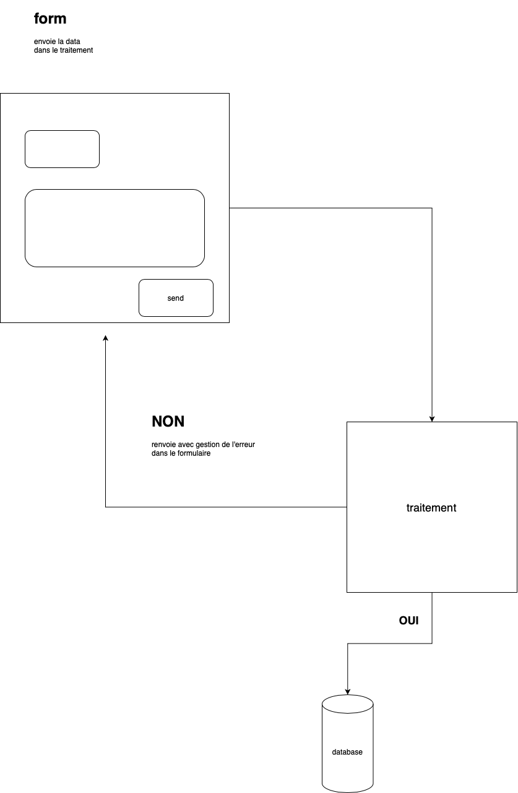
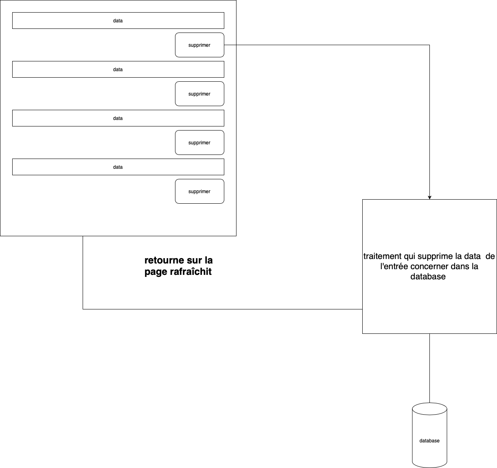

## exo 4 ##

**suite de exo3**

* creer d'une dataBase 
* creation d'un table correspondant au formulaire traitée (libre ous pouvez prendre votre ancien exercice ou refaire depuis le debut)
* connexion à la base de donnée
* envoyer les donnée depuis le traitement vers la table de la base de donnée
* creer un vue pour lire la data depuis la dataBase
* implementer un moyen de supprimer l'entree de la base
****
* exemple table:  

*****
* exemple flux form :
* 
*****
* exemple vue :
* 

## une application communiquant avec une dataBase pour y stockée de la data structurée dans une table.ainsi qu'une page qui affiche les entrée de cette table 

